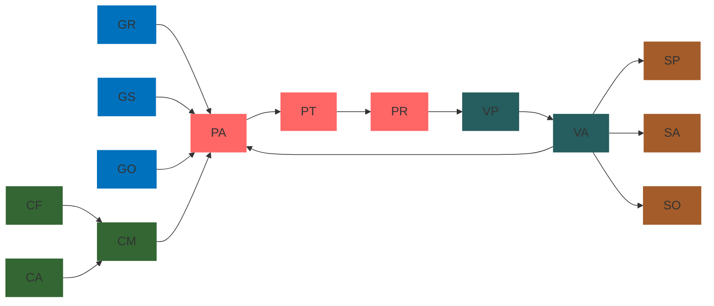

# Privacy-Aware System Design Process

## Description

This project outlines a comprehensive process for designing privacy-aware systems. The Mermaid.js diagram below visualizes the workflow and relationships between different stages of the process, from defining privacy goals to selecting strategies and solutions.

## Mermaid Diagram



### Mermaid Syntax

```
graph LR
  GR-->PA
  GS-->PA
  GO-->PA
  CF-->CM
  CA-->CM
  CM-->PA
  PA-->PT
  PT-->PR
  PR-->VP
  VP-->VA
  VA-->SP
  VA-->SA
  VA-->SO
  VA-->PA
style GR fill:#0071bc;
style GS fill:#0071bc;
style GO fill:#0071bc;
style CF fill:#336633;
style CA fill:#336633;
style CM fill:#336633;
style PA fill:#ff6666;
style PT fill:#ff6666;
style PR fill:#ff6666;
style VP fill:#265D5E;
style VA fill:#265D5E;
style SP fill:#A45C2A;
style SA fill:#A45C2A;
style SO fill:#A45C2A;
```

## Diagram Legend

| Process | Code | Task |
|---------|------|------|
| Defining Privacy Goals | GR | Regulation Requirements |
| | GO | Users, Stakeholders and Organization |
| | GS | Standards and Principles |
| Characterizing the System | CF | Elicit Functional Requirements |
| | CM | Model-Based |
| | CA | Assets and Data Inventory |
| Privacy Risks and Requirements Elicitation | PA | Privacy Impact Assessments |
| | PT | Privacy Threat Analysis |
| | PR | Elicit Privacy Requirements |
| Validation and Prioritization | VP | Prioritization of Privacy Requirements/Risk |
| | VA | Adjustment and Validation |
| Strategy and Solution Selection | SP | Privacy Patterns and PETs selection |
| | SA | Designing Privacy-Aware Architecture |
| | SO | Organizational Measure |

### Color Coding

- Blue nodes (#0071bc): Defining Privacy Goals
- Green nodes (#336633): Characterizing the System
- Red nodes (#ff6666): Privacy Risks and Requirements Elicitation
- Teal nodes (#265D5E): Validation and Prioritization
- Brown nodes (#A45C2A): Strategy and Solution Selection

## How to Use

You have two options to work with this Mermaid diagram:

### Option 1: Use Mermaid Live Editor (Online)

1. Go to [https://mermaid.live/](https://mermaid.live/)
2. Copy the Mermaid syntax provided above and paste it into the editor.
3. The diagram will be rendered automatically.
4. You can modify the code and see real-time updates to the diagram.

### Option 2: Install Mermaid.js (Offline)

1. Install Mermaid.js in your project.
2. Copy the Mermaid diagram code into your Markdown file or HTML page.
3. Ensure your Markdown renderer or website supports Mermaid.js rendering.

For both options, use the legend to understand the meaning of each node in the diagram.

## Customization

You can customize the diagram by modifying the Mermaid.js code. The current configuration includes:

- Custom node colors corresponding to different processes
- White text color for better readability
- Arial font
- 18px font size
- No stroke width
- Transparent node borders

To apply these styles in Mermaid Live Editor, you can add the following configuration at the beginning of your Mermaid code:

```
%%{
  init: {
    "theme": "default",
    "themeVariables": {
      "nodeTextColor": "#ffffff",
      "fontFamily": "arial",
      "fontSize": "18px",
      "stroke-width": 0,
      "nodeBorder": "transparent"
    }
  }
}%%
```
